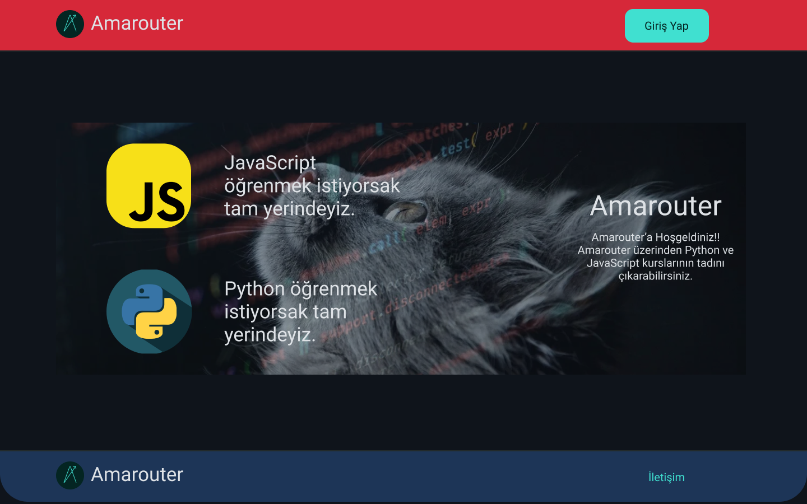

## Landing Page

Amarouter Landing Page kullanıcı arayüzü ve açıklamalarına bu bölümden ulaşıyoruz ve inceliyoruz.
 
 

Görsel 1: Amarouter Landing Page
 
 

Landing Page üç ana bölümden oluşuyor: Top Bar, Body, Footer.

### Top Bar

Top bar'da Amarouter logosu ve Giriş Yap butonu bulunuyor.

### Body

Body bölümünde JavaScript ve Python kurslarına yönlendiren kısımlar ve Amarouter'ın tanıtımını yapan bir yazı bulunuyor.

### Footer

Footer'da Amarouter logosu ve İletişim bağlantısı bulunuyor.