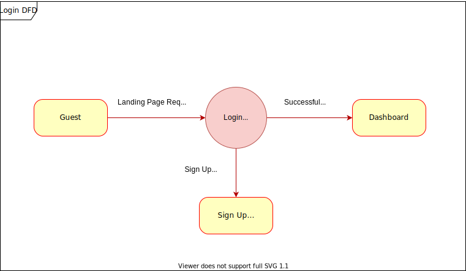
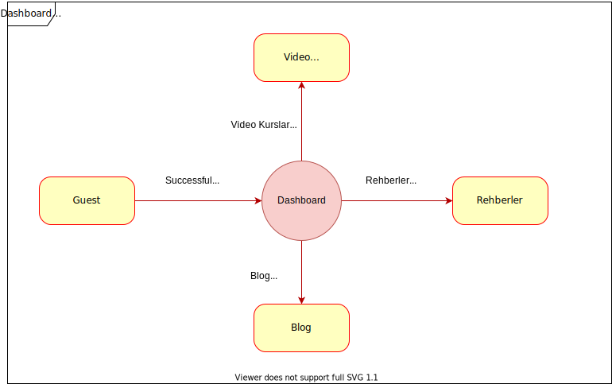

## Specific Requirements (Section 3)

Bu bölümde ürünün Grafiksel Kullanıcı Arayüzleri tanıtılır.
Ayrıca Functions başlığı altında sistemi daha iyi anlatan DFD(Data Flow Diagram) çizimleri eklenir.

### User Interfaces

Kullanıcı arayüzlerini daha kolay takip edilebilmesi için ayrı dosyalarda tanıtıyoruz.

- section-3.1-landing-page
- section-3.2-dashboard
- section-3.3-rehberler
- section-3.4-video-kurslar
- section-3.5-blog

### Functions

Sistemin fonksiyonel gereksinimleri DFD çizimleriyle detaylandırılır.

#### User Authentication

Görsel 1: User Authentication DFD

#### Dashboard

Görsel 1: Dashboard DFD