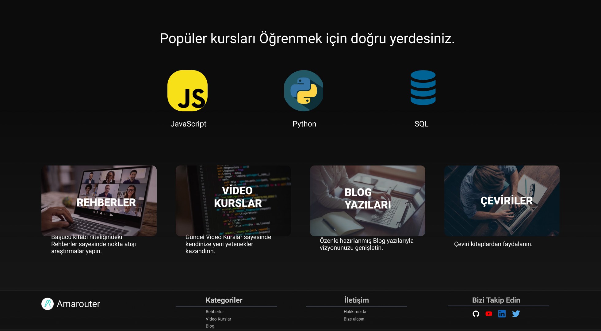

## Landing Page

Amarouter Landing Page kullanıcı arayüzü ve açıklamalarına bu bölümden ulaşıyoruz ve inceliyoruz.
 
 

Görsel 1: Amarouter Landing Page
 
 

Landing Page üç ana bölümden oluşuyor: Top Bar, Body, Footer.

### Top Bar

Top bar'da Arama çubuğu ve Giriş Yap butonu bulunuyor.
### Body

Body bölümü ikiye ayrılıyor. Birinci bölümde giriş yap kısmı bulunuyor. İkinci bölümde JavaScript, Python ve SQL kurslarına yönlendiren kısımlar ve Amarouter'ın tanıtımını yapan bir kısım bulunuyor.

Görsel 2: Amarouter Landing Page 2
 

### Footer

Footer'da Amarouter logosu, Kategoriler, İletişim ve Sosyal Medya bölümleri bulunuyor.