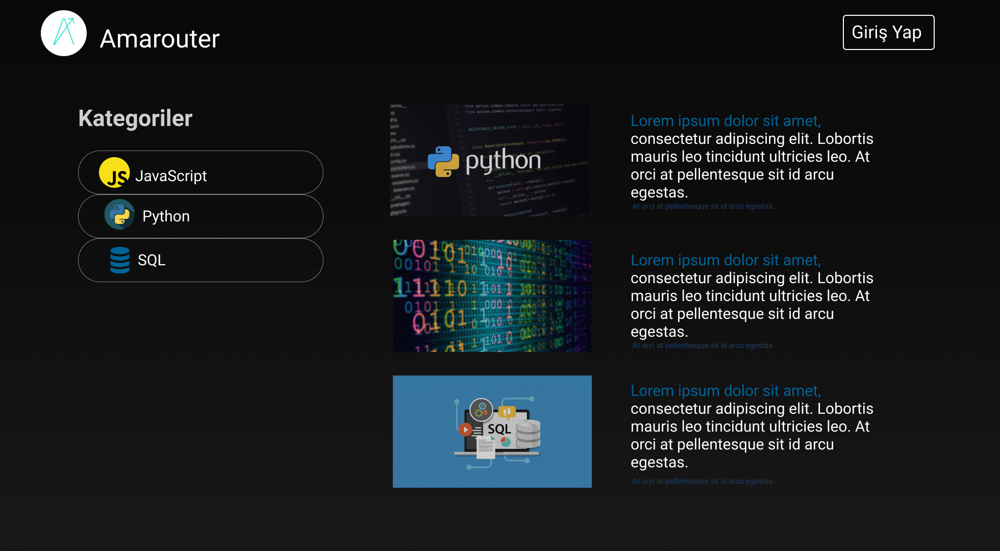
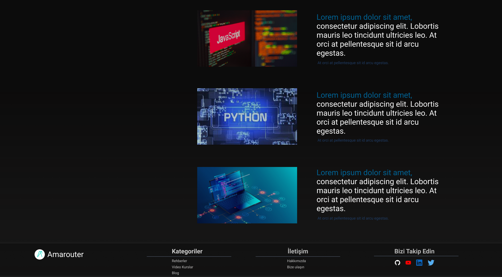

## Blog

Amarouter Blog kullanıcı arayüzü ve açıklamalarına bu bölümden ulaşıyoruz ve inceliyoruz.
 
 

Görsel 1: Amarouter Blog
 
 

Blog üç ana bölümden oluşuyor: Top Bar, Body, Footer.

### Top Bar

Top bar'da Arama çubuğu ve Giriş Yap butonu bulunuyor.
### Body

Body bölümü ikiye ayrılıyor. Birinci bölümde kategoriler ve blog başlıkları bulunuyor. İkinci bölümde blog başlıklarının devamı bulunuyor.

Görsel 2: Amarouter Blog 2
 

### Footer

Footer'da Amarouter logosu, Kategoriler, İletişim ve Sosyal Medya bölümleri bulunuyor.